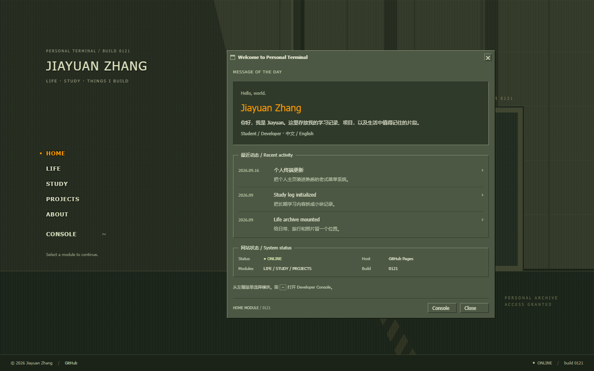

# Jiayuan Zhang — Personal Terminal

个人主页装进 Half-Life 菜单系统。直接改造
[arlagonix/half-life-screen](https://github.com/arlagonix/half-life-screen)
的 React/SCSS 菜单、可拖动窗口、按钮和标签页。

原项目是 Half-Life 2 菜单复刻；这里保留其组件实现，并按 GoldSrc 方向改为
橄榄绿实色面板、橙色选中、Tahoma/Verdana 小字号、直角与 1px bevel 边框。
没有包含 Valve/Half-Life 图片、Logo、音频、视频或字体文件。



## 本地运行

需要 Node.js 22.12+（CI 使用 Node 22）。

```sh
npm ci
npm run dev
```

```sh
npm run lint
npm run build
npx playwright install chromium
npm test
```

Windows 如已安装 Chrome，也可以运行 `$env:PLAYWRIGHT_CHANNEL='chrome'; npm test`。
测试使用不带 SPA fallback 的静态服务器，验证真实构建产物。

## 页面与交互

| 路径 | 内容 |
| --- | --- |
| `/` | 简介、最近动态、网站状态 |
| `/life/` | 日常、旅行、照片、游戏/电影、日志 archive |
| `/study/` | 学习记录、论文阅读、AI / ML、Computer Systems、任务清单 |
| `/projects/` | 项目与技术栈，ALL / ONLINE / WIP / ARCHIVED 筛选 |
| `/about/` | Player Profile、GitHub、Email、CV、模板 attribution |

- 主菜单使用普通链接，每个路径有真实 HTML 入口，刷新子页面不依赖 SPA 路由。
- 可拖动窗口标题栏；关闭窗口后，点击主菜单可重新进入。
- `~` / 反引号打开或关闭 Console；`Esc` 关闭；上下键浏览命令历史。
- Console 支持 `help`、`status`、五个页面名、`github`、`credits`、`clear`、`close`、`exit`。
- Console 只处理固定命令，不执行 JavaScript 或系统命令。
- 小屏幕保留纵向菜单，窗口排在其下方，避免横向挤压。
- 学习任务复选框仅记录当前页面会话，刷新后重置。

## 修改个人内容

编辑 `src/content.ts`：简介、联系方式、动态、日常日志、学习主题、任务与项目。
个人内容布局位于 `src/components/PageContent.tsx`。

- `profile.email` 默认为空，显示「暂未公开」。填入真实邮箱后自动生成邮件链接。
- `profile.cv` 默认为空，显示「暂未发布」。放入 `public/cv.pdf` 后设为 `/cv.pdf`。
- 旅行、照片、论文和额外项目使用真实空状态，不包含虚构记录或假链接。
- 新增照片时，把有权发布的照片放到 `public/`，再更新内容组件；同时调整
  `scripts/check-build.mjs` 的资产白名单，避免未经审查的图片进入产物。

## GitHub Pages 部署

**首次切换前：仓库管理员需在 Settings → Pages → Build and deployment → Source
选择 GitHub Actions。当前仓库原设置是 Deploy from a branch / main / root。**

然后合并 PR 到 `main`。`.github/workflows/pages.yml` 自动：

1. `npm ci` 安装锁定依赖。
2. 运行 lint、TypeScript/build、静态资源与许可证检查、Playwright 浏览器测试。
3. 上传 `dist/` 为 Pages artifact。
4. 使用 `actions/deploy-pages` 发布到 https://jiayuanzhang0121.github.io/。

工作流也支持手动运行。PR 只进行检查；fork 不部署到原站点。
无需额外 secret。`GITHUB_TOKEN` 仅部署 job 请求 `pages: write` 和 `id-token: write`。

这不是 Jekyll 源码站点，不能继续直接发布仓库根目录。`dist/` 包含五个页面
及一个实际的 `404.html`。未知 URL 会显示恢复入口，不会静默变成首页。
根域名站点使用 `base: '/'`。

部署方式依据 [GitHub Pages custom workflows](https://docs.github.com/en/pages/getting-started-with-github-pages/using-custom-workflows-with-github-pages)
和 [Vite static deployment](https://vite.dev/guide/static-deploy.html)。

## 文件结构

```text
src/
  pages/HalfLifeScreen/        # 上游菜单和布局的个人站点改造
  components/Modal/           # 上游可拖动窗口和标签页
  components/Button/          # 上游 bevel 按钮
  components/PageContent.*    # 五个内容模块
  components/Console.*        # Developer Console
  content.ts                  # 可编辑的个人内容
  index.tsx / index.scss      # React 入口与全局样式
index.html                    # HOME
life|study|projects|about/     # 各自独立的 HTML 入口
404.html                      # 缺失页面
public/                       # 原创 favicon、许可证和 attribution
scripts/                      # 静态构建检查、测试服务、预览截图
tests/                        # 桌面 / 手机浏览器检查
.github/workflows/pages.yml   # build + test + deploy
docs/UPSTREAM_REVIEW.md        # 结构、许可证、依赖、迁移与资源审查
docs/previews/                # 实际浏览器截图
```

## 许可证与复用范围

原 MIT 版权、许可和免责声明原样保存在 `LICENSE`，并发布到
`/licenses/half-life-screen-MIT.txt`。改造文件映射和资源排除说明见
[THIRD_PARTY_NOTICES.md](THIRD_PARTY_NOTICES.md) 与
[upstream review](docs/UPSTREAM_REVIEW.md)。
修改 notices 时同步 `public/THIRD_PARTY_NOTICES.md`；构建检查会校验一致性。

Half-Life、GoldSrc 和 Valve 仅用于说明视觉参考；本网站与 Valve 无关联。
